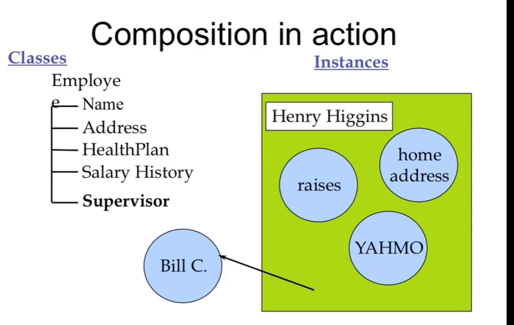

<!--
 * @Author: your name
 * @Date: 2022-03-02 23:09:44
 * @LastEditTime: 2022-03-16 18:24:40
 * @LastEditors: Please set LastEditors
 * @Description: 打开koroFileHeader查看配置 进行设置: https://github.com/OBKoro1/koro1FileHeader/wiki/%E9%85%8D%E7%BD%AE
 * @FilePath: \C++\6. Reusing the implementation\reusing the implementation.md
-->
# Reusing the implementation
# 封装 继承 多态性

## Composition
    1.consturct new object with existing objects 
    2.It is the relationship of "has-a"

**以已有的对象进行组合，进而创建新的对象**

###Such As
>Object(Car)
>>1.Object(engine)
>>2.Object(tyre)




```cpp
class Person {...};
class Currency {....};
class SavingsAccount {
    public:
        SavingsAccount(const char* name, const char* address, int cents);
        ~SavingsAccount();
        void print();
    private:
        Person m_saver;
        Currency m_balance;
}
```
**SavingsAccount 的对象的对象有各自对象的构造函数进行初始化，以及方法的操作**
```cpp
SavingAccount::SavingsAccount (const char* name, const char* address, int cents):m_saver(name, address), m_balance(0,cents) {}

void SavingsAccount::print() {
    m_saver.print();
    m_balance.print();
}
```

**对象的初始化都应该在*initialization list*里进行，不应当在构造函数里进行初始化(虽然这是可行的或可实现的)**

如果以下列这种方式进行实现就必须有默认的构造函数
```cpp
SavingsAccount::SavingsAccount (const char* name, const char* address, int cents) {
    m_saver.set_name(name);
    m_saver.set_address(address);
    m_balance.set_cents(cents);
}
```
如果对象是公开的那么就有可能会进行直接访问的操作，这是一种实现的思路，但是违反了（鸡蛋模型）突破了边界(心脏在外面)